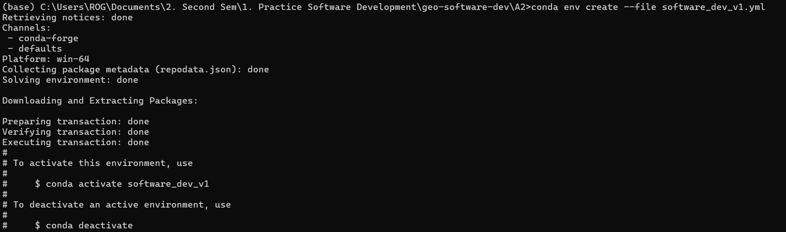
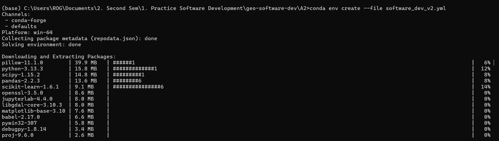
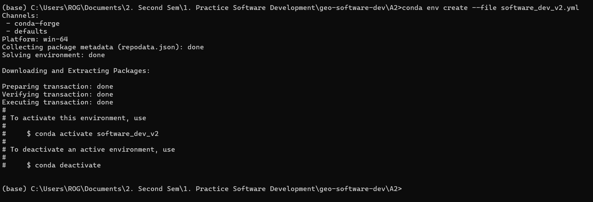
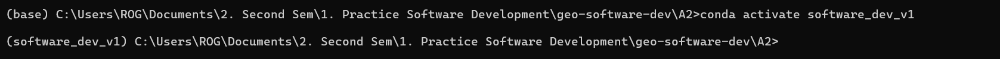
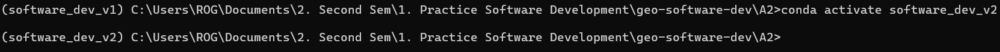
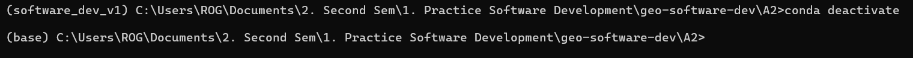

## Create Environment using files
1. Fork the repo and clone the repo
2. Open Anaconda Prompt
2. Navigate to the folder and use the command to create this environment using file:
    conda env create --file envname.yml  #replace the envname with the name of your env file. 
    For me, I created two environments: 
    a. conda env create --file software_dev_v1.yml
       - It will start downloading the required files and packages and extract them to create the environment. After its done it will also provide the command to activate the environment. Note: currently we are in base environment. see the (base) in the beginning. Your prompt will look like this after the environment is created. 
       

    b. conda env create --file software_dev_v2.yml
        - Similarly it will download the packages and extract them. 
        
        - After its done, it look like this: 
        

3. Now activate the desired environment using the command: conda activate software_dev_v1 or conda activate software_dev_v2
    

    Note: check in the front of the line the environment changed from base to software_dev_v1. That means everything you do from now or everything you install will be installed within this environment. 

    

4. You can also deactivate the environment using the command: conda deactivate

    

---------------------------------------------------------------------------------------------
# A2: Instructions

Here are the two conda environment files to recreate:

- *software_dev_v1.yml*
- *software_dev_v2.yml*

They are descriptions of the exact same environment, however, one description is more specific yet operating system (OS) dependent, and the other is OS generic but much less specific (i.e. no versions). Depending on the OS you are working on, you may be able to recreate both.

## Task

Go through the process of re-creating environments:

1) **Acquire** You can fork this repo or just download both files individually.
2) **Recreate** both environments with conda (or try to do so). You can use the commandline or the navigator (see tutorial document as PDF here, but also available in Blackboard)
3) **Document** Document the process of recreating the environments in the README.md file associated with your GitHub repsository for this course. Please share screenshots and descriptions of error messages but also of things that worked out.

